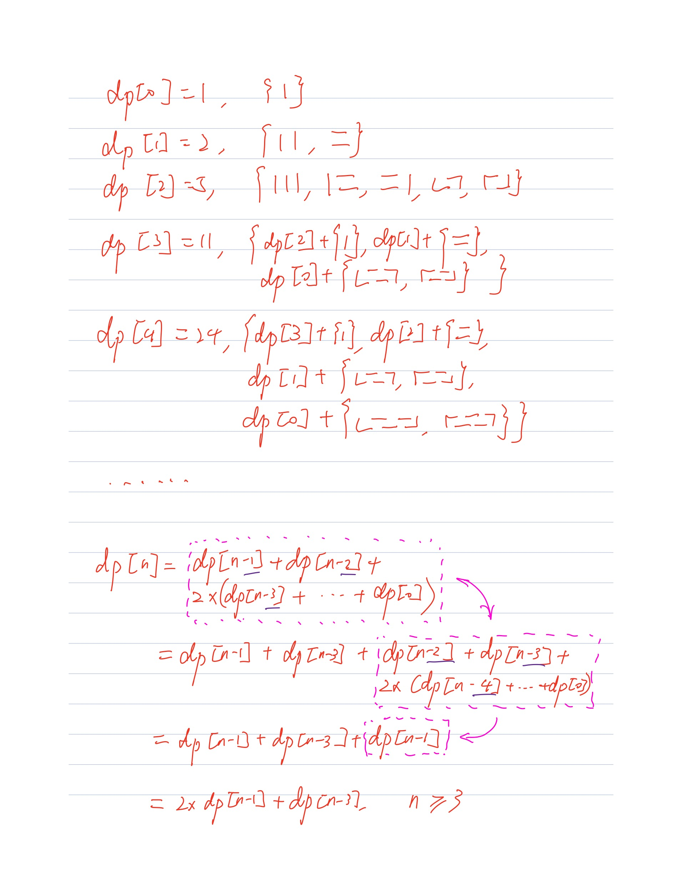

# 790. Domino and Tromino Tiling

| 题目 | 难度 |
| ---- | ---- |
| [790. Domino and Tromino Tiling](https://leetcode.com/problems/domino-and-tromino-tiling/) | Medium |

## 题意

有两种拼图，一种`1 * 2`的，一种三块构成`L`行的，拼图可以旋转，问拼在`2 * n`的板子上，共有多少种拼法，结果模除`10 ** 9 + 7`。

## 分析

很显然是一维动态规划题。

## 题解1

### 思路

递推公式：`dp[i] = 2 * dp[i - 1] + dp[i - 3]`，推导过程见下图。



思路来源：[Detail and explanation of O(n) solution why dp[n]=2*d[n-1]+dp[n-3]](https://leetcode.com/problems/domino-and-tromino-tiling/discuss/116581/Detail-and-explanation-of-O(n)-solution-why-dpn2*dn-1%2Bdpn-3)

### 代码

```python
class Solution:
    def numTilings(self, n: int) -> int:
        dp = [0] * max(n, 3)
        dp[0] = 1
        dp[1] = 2
        dp[2] = 5
        for i in range(3, n):
            dp[i] = (2 * dp[i - 1] + dp[i - 3]) % (10 ** 9 + 7)
        return dp[n - 1]
```

### 说明

同思路。

### 评估

| 时间复杂度 | 空间复杂度 |
| ---- | ---- |
| O(n) | O(n) |

| | 运行时间 | 内存占用 |
| ---- | ---- | ---- |
| 数值 | 24ms | 14.2MB |
| 排名 | 98.46% | 87.44% |

## 总结

这个递推公式实在是太难想了。
